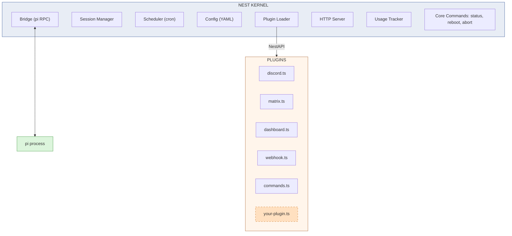
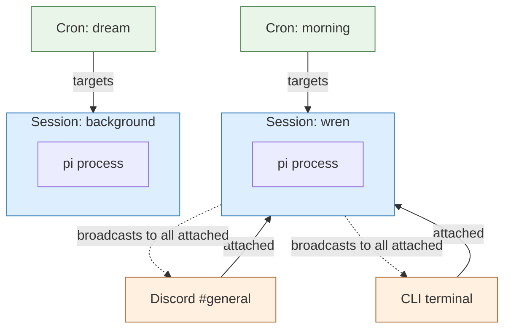
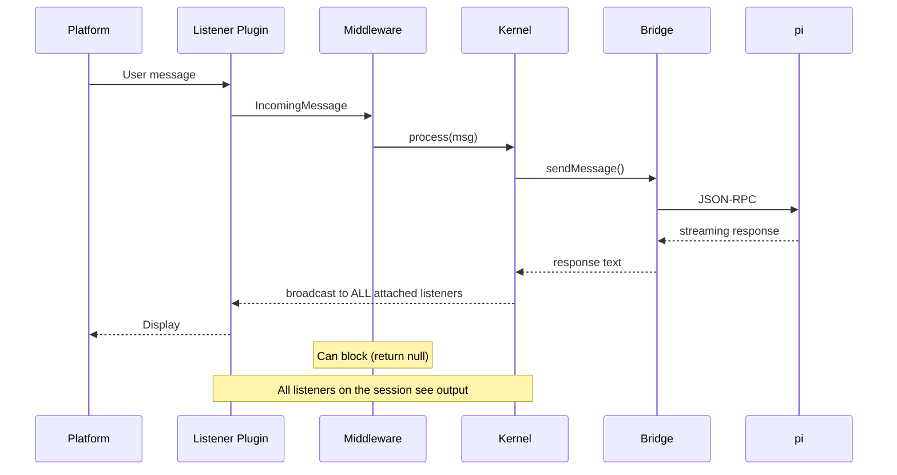

# Nest

Minimal agent gateway kernel. Sessions, plugins, cron, HTTP.

Nest does five things: manages pi sessions, loads plugins, runs cron jobs, handles config, and serves HTTP. Everything else — listeners, commands, dashboards, middleware, security — is a plugin.

## Architecture



## Sessions

Sessions are the central concept. Everything else attaches to them.



- **Sessions are independent pi processes** with their own conversation history
- **Listeners attach to sessions** — Discord, CLI, webhook are all views into a session
- **Multiple listeners on one session** — CLI and Discord both see the same conversation
- **Cron jobs target sessions** — no notify channels, output goes to all attached listeners

## Message Flow



## Plugins

A plugin is a `.ts` file (or directory with `index.ts`) in the plugins directory. It exports a default function receiving a `NestAPI` object:

```typescript
import type { NestAPI } from "../src/types.js";

export default function(nest: NestAPI) {
    nest.registerMiddleware({
        name: "my-guard",
        async process(msg) {
            // block, transform, or pass through
            return msg;
        },
    });
}
```

### NestAPI

```typescript
interface NestAPI {
    // Register capabilities
    registerListener(listener: Listener): void;
    registerMiddleware(middleware: Middleware): void;
    registerCommand(name: string, command: Command): void;
    registerRoute(method: string, path: string, handler: RouteHandler): void;

    // Sessions (attach/detach model)
    sessions: {
        get(name): Bridge | null;
        getOrStart(name): Promise<Bridge>;
        attach(session, listener, origin): void;
        detach(session, listener): void;
        getListeners(session): Array<{ listener, origin }>;
        // ...
    };

    // Usage tracking, config, logging, instance info
    tracker: { record(), today(), week(), ... };
    config: Config;
    log: { info(), warn(), error() };
    instance: { name, dataDir };
}
```

### Shipped Plugins

| Plugin | What it does |
|--------|-------------|
| `discord.ts` | Discord listener with emoji resolution, attachments |
| `matrix.ts` | Matrix listener |
| `dashboard.ts` | API routes for status, sessions, usage, logs + static file serving |
| `webhook.ts` | POST /api/webhook → send message to session |
| `commands.ts` | Extended bot commands: model, think, compress, new, reload |

## Config

```yaml
instance:
    name: "wren"
    pluginsDir: "./plugins"

sessions:
    wren:
        pi:
            cwd: /home/wren
            extensions:
                - /app/extensions/attach.ts

defaultSession: wren

server:
    port: 8484
    token: "env:SERVER_TOKEN"

cron:
    dir: ./cron.d

# Plugin config — plugins read their own sections
discord:
    token: "env:DISCORD_TOKEN"
    channels:
        "123456": "wren"
```

## Running

```bash
npm install
npm run dev              # tsx src/main.ts
npm run dev config.yaml  # custom config path
```

## Writing Plugins

1. Create a `.ts` file in the plugins directory
2. Export a default function that takes `NestAPI`
3. Call registration methods to add capabilities
4. Restart nest to load the plugin

The agent can write plugins too — that's the point.

## File Structure

```
nest/
├── src/                    # Kernel (~2,700 lines)
│   ├── main.ts             # Entry point
│   ├── kernel.ts           # Core orchestration
│   ├── bridge.ts           # RPC pipe to pi
│   ├── session-manager.ts  # Sessions (central hub)
│   ├── scheduler.ts        # Cron
│   ├── config.ts           # YAML config
│   ├── plugin-loader.ts    # Scan, import, inject NestAPI
│   ├── server.ts           # HTTP skeleton
│   ├── types.ts            # All interfaces
│   ├── tracker.ts          # Usage tracking
│   └── ...                 # logger, chunking, image, inbox
├── plugins/                # Features (~600 lines)
│   ├── discord.ts
│   ├── matrix.ts
│   ├── dashboard.ts
│   ├── webhook.ts
│   └── commands.ts
└── config.yaml
```
